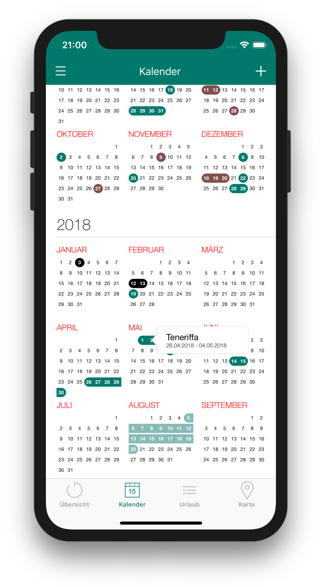

German version: [README-de.md](README-de.md)

# Overview
Leave Days is an iPhone app, which counts and manages your annual leave days. Leave days can be saved in the app and displayed in different views. The app automatically calculates your remaining leave, and also considers residual leave, public holiday and weekends.

  

# Privacy statement

### 1) Provider
Responsible provider of this app is:    

 Patrick Fial    

### 2) Data processed by the app
The app does not need/process personal data, however the app allows to manage leave days for multiple persons, and thus the user can decide to create separate users within the app. In this case, the provided name and password of the user is also saved within the app.

The app can also access calendar data on the device for the purpose of obtaining public holidays. This information is only used 1) to calculate the duration of leave 2) to be displayed within the apps calendar view.

The app contains an import feature, which allows the user to import previously created backup files into the app. In this case, the app will ask for permission to access folders on the device to load a backup file. Those files are only accessed during import, and not accessed further/again after the import process has ended. The app does not access/load/open data other than what was created as a backup with the app (in other words: it cannot read other files than its own backup files).

### 3) Data transfer to third parties
This app does not transmit any data. All data is stored within the app itself, with two exemptions:

- The feature to store leave entries within a calendar on the device, in which case data is also stored within the calendar of the device.
- The feature to create backup of the app data in a folder on the device.

The app does not use any form of analytics, advertising and the likes, and does therefore not transfer its data to thirdparties for those purposes.

### 4) Permissions requested by the app
The app can ask the user for following permissions if the corresponding option is enabled in the settings:

- **Access to the calendars device**.
Needed to retrieve information of public holidays
Needed to store leave entries within a calendar on the device on request of the user
- **Use notifications**.
Needed to display a badge-counter at the app icon on the homescreen

### 5) Revoking permission / Deletion of personal data
The app does not transfer data to the app provider. Therefore, only the user himself/herself can delete the data which was recorded by the app by doing one of the following:

- Remove the app from the device
- Use the delete-data-button within the app

Backups stored in folders on the device are not affected by this and must be deleted manually by the user.

All permissions mentioned in 4) can be revoked at any time by the user in the iPhone's device/privacy settings.
